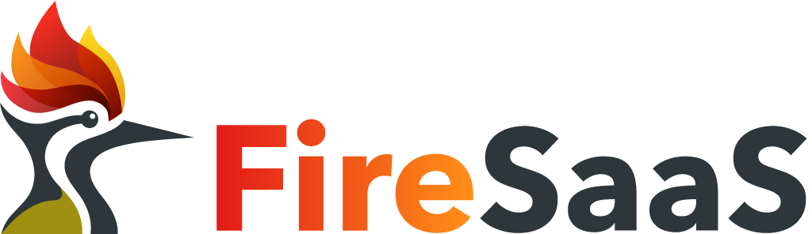

<p align="center">
  
</p>

<p align="center">
  <a href="https://nextjs.org"></a>
  <a href="https://firebase.google.com"></a>
  <a href="https://firebase.google.com/docs/genkit"></a>
  <a href="https://tailwindcss.com"></a>
  <a href="https://typescriptlang.org"></a>
  <a href="https://vitest.dev"></a>
</p>

# FireSaaS Starter Kit

> Build AI-powered, multi-tenant SaaS products faster with Next.js App Router, Firebase Suite, and Genkit.

**FireSaaS** is a production-grade, Firebase-native, test-first Next.js SaaS boilerplate engineered for startups, indie hackers, agencies, and product teams. It handles the critical plumbing of SaaS applications so you can focus on building your core features.

---

## Key Features

- 🔐 **Firebase Authentication**: Client-side login flow with Google Provider & Email/Password, synced securely with HTTP-only cookies (`__session`) for server-side verification in Middleware & Server Actions.
- 🏢 **Multi-Tenancy & Workspaces**: Workspace isolation with robust role-based access control (`owner`, `admin`, `member`, `viewer`) enforced at the Firestore rules level.
- 🤖 **Genkit AI Orchestration**: Pre-configured Genkit engine with structured JSON schema outputs, article text summarization flows, and stateful chatbot assistant widgets.
- 📁 **File Upload Console**: Drag-and-drop secure media uploader powered by Firebase Storage. Validates file sizes (<20MB) and mime-types, separating assets in tenant-isolated paths.
- 🛡️ **Server-First Security**: Client inputs verified against Zod schemas, Server Actions protected by authorization wrappers, and cross-service security rules.
- 📊 **Compliance Logs**: Global audit trail logging all actions (user created, workspaces made, files removed, AI flows ran).
- 🧪 **Full-Stack Test Suite**: Standard configurations and baseline test examples for Unit tests, Local Emulator Rules tests (Firestore & Storage), and Playwright E2E automation.
- 🎨 **Premium Styling**: Next.js App Router (16.x) built with Tailwind CSS v4, dark/light theme triggers (next-themes), and responsive shadcn-like cards and layouts.

---

## Tech Stack

- **Core**: Next.js App Router, React, TypeScript, Tailwind CSS, Lucide icons, clsx, Zod, React Hook Form
- **Firebase**: Firebase client SDK, Firebase Admin SDK, Cloud Firestore, Firebase Storage, Firebase Auth, Local Emulator Suite
- **AI**: Firebase Genkit, Google GenAI SDK (Gemini models)
- **Testing**: Vitest, `@firebase/rules-unit-testing`, jsdom, Playwright E2E

---

## Project Structure

```txt
fire-saas-starter-kit/
├── app/                  # Next.js App Router (Marketing, Auth, and Dashboard routes)
├── components/           # Shared components (layouts, theme provider & toggle)
├── features/             # Feature modules (Auth context, User profiles, Organizations, Files, AI, Audits)
├── firebase/             # Client & Admin SDK initializers, converters, and path constants
├── genkit/               # Genkit orchestration config and Zod schema flows
├── docs/                 # In-depth architectural guides and setup instructions
├── tests/                # Testing suites (unit, rules integration, E2E routing)
├── firestore.rules       # Security rules for Cloud Firestore
├── storage.rules         # Security rules for Firebase Storage
├── firebase.json         # Firebase Emulator ports mapping
├── AGENTS.md             # Developer guidelines for coding agents
└── package.json          # Node scripts and dependency roster
```

---

## Getting Started

Follow these steps to run the starter kit locally in development mode:

### 1. Clone & Install Dependencies

Ensure you have `pnpm` installed, then run:

```bash
pnpm install
```

### 2. Configure Environment Variables

Copy the template variables file:

```bash
cp .env.example .env
```

_(For local development, the pre-filled demo settings in `.env` are ready to bind to local Firebase emulators without any real keys.)_

### 3. Run Firebase Emulators

The project is set up to run entirely offline using the Firebase Emulator Suite. Start them in a dedicated shell:

```bash
pnpm run dev:emulators
```

This runs:

- Auth Emulator (Port `9099`)
- Firestore Emulator (Port `8080`)
- Storage Emulator (Port `9199`)
- Emulator Suite UI Dashboard (Port `4000`)

### 4. Run Next.js Server

In a separate shell, start the Next.js development server:

```bash
pnpm run dev
```

Open [http://localhost:3000](http://localhost:3000) to view the landing page!

---

## Testing Commands

The project contains baseline test cases that cover each layer of the test pyramid:

- **Run Unit Tests** (Permissions, paths, envs):
  ```bash
  pnpm run test:unit
  ```
- **Run Security Rules Tests** (Requires the Firebase emulators to be running):
  ```bash
  pnpm run test:rules
  ```
- **Run Playwright E2E Tests**:
  ```bash
  pnpm run test:e2e
  ```

---

## Deployment Summary

- **App Hosting**: Configure `apphosting.yaml` to deploy your Next.js frontend and Node backend.
- **Environment keys**: Make sure to add `GOOGLE_GENAI_API_KEY`, `FIREBASE_CLIENT_EMAIL`, and `FIREBASE_PRIVATE_KEY` inside your cloud hosting dashboard (e.g. Firebase Console or Vercel Settings).
- Detailed deployment steps are located at `docs/deployment.md`.
