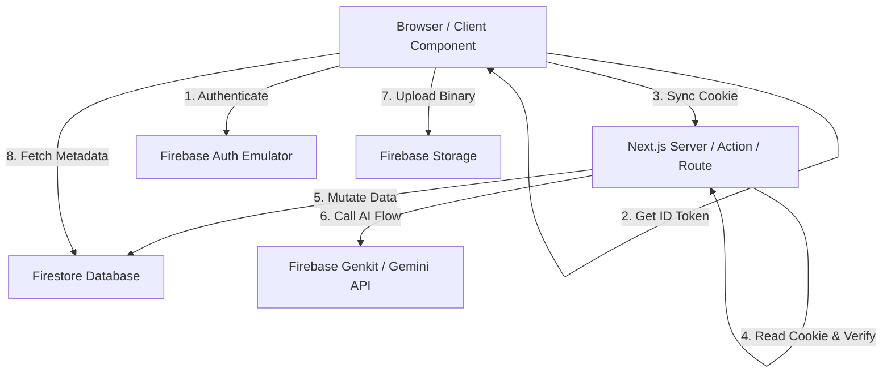

# Architecture Guide

This document explains the high-level architecture, module design decisions, and session security constraints in the **FireSaaS Starter Kit**.

---

## 1. High-Level Architecture

FireSaaS follows a modern hybrid architecture combining Next.js App Router (16.x) with the Firebase Suite:



1. **Client Authentication**: Users log in via the Firebase JS SDK (Google Provider or Email/Password).
2. **Session Cookie Syncing**: The client listens to authentication state changes. On state update, it fetches the short-lived Firebase ID Token and POSTs it to the Next.js API endpoint `/api/auth/session`, which stores it in a secure, HTTP-only cookie named `__session`.
3. **Server Verification**: In Next.js Middleware, Server Components, and Server Actions, the `__session` cookie is read and verified using the `firebase-admin` SDK. This ensures all server mutations are fully authenticated.
4. **Direct Client Reads & Storage**: For high-performance responsive interfaces, the client components subscribe to Firestore records (e.g. file rosters, members tables) in real-time. Files are uploaded directly from the client to Firebase Storage, enforcing size and mime boundaries.

---

## 2. Session Management & Caching

### The `__session` Cookie Constraint

Firebase Hosting and Firebase App Hosting cache static contents via their global CDN. To optimize performance, the CDN strips out all custom request headers and cookies _except_ the cookie named `__session`.

Therefore, **we must name our session cookie `__session`**. If you rename it, the cookie will be stripped by the hosting provider in production, breaking all server-side authentications.

---

## 3. Feature-First Folder Organization

Rather than dumping actions, schemas, views, and styles in generic root directories (which causes bloat in large codebases), FireSaaS groups files by business feature:

```txt
features/
├── auth/           # useAuth client context, cookie sync routes, server helpers
├── users/          # User Firestore profile schemas and onboarding Actions
├── organizations/  # Workspace CRUD actions, members roster, invite fields
├── files/          # File upload metadata schemas and storage deletion Actions
└── ai/             # Genkit flow executions, AI usage loggers
```

Each feature folder represents a self-contained module containing:

- `schema.ts`: Zod schema validations.
- `actions.ts`: Server Actions (`"use server"`) for mutations.
- `permissions.ts` (if applicable): Access mapping files.

---

## 4. Multi-Tenancy Data Boundaries

We enforce strict data boundaries using nested Firestore document paths:

- Organization data: `organizations/{orgId}`
- Workspace Members: `organizations/{orgId}/members/{userId}`
- File metadata: `organizations/{orgId}/files/{fileId}`
- AI Usage logs: `organizations/{orgId}/aiUsage/{usageId}`
- Compliance audit trails: `organizations/{orgId}/auditLogs/{logId}`

Firestore and Storage Security Rules inspect these paths. They block requests unless the client's `request.auth.uid` matches a valid member document inside `organizations/{orgId}/members`.
